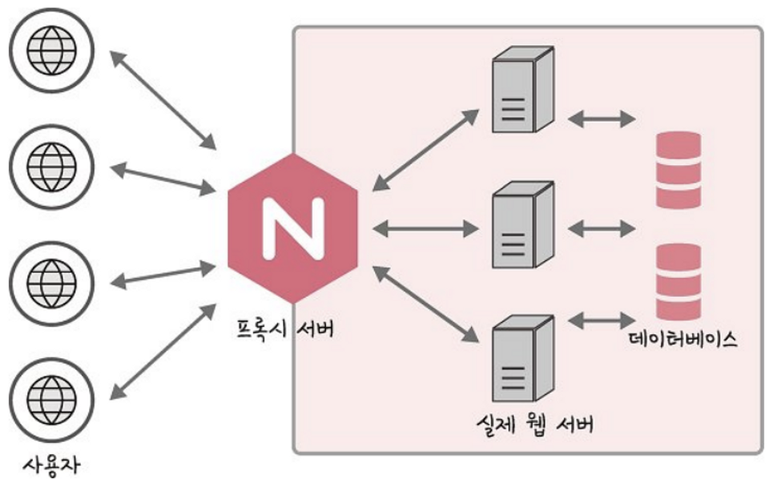
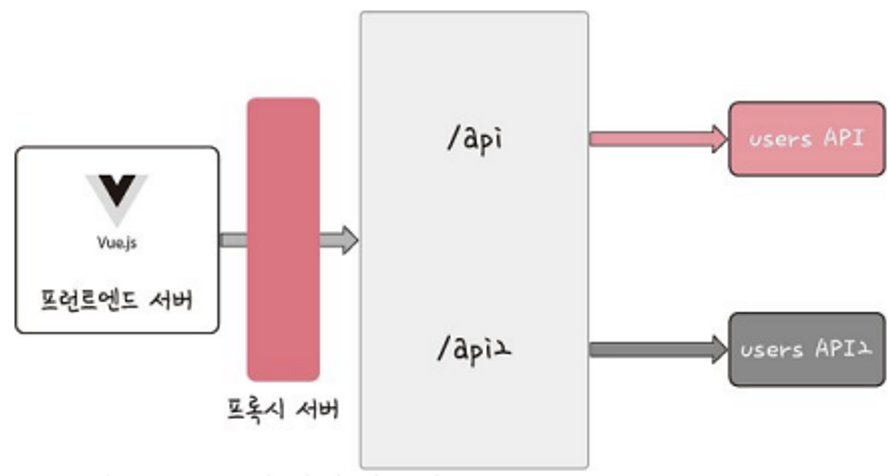

# 프록시 패턴

프록시 (Proxy) : 대리자, 대변인.

📌  **프록시 패턴** : 프록시에게 어떤 일을 대신 시키는 것. 대상 객체에 접근하기 전 접근 흐름을 가로채, 접근하고자 하는 객체 앞단의 인터페이스 역할을 하는 것.

- 프록시 객체는 원래 객체를 감싸고 있는 객체. 원래 객체와 타입은 동일함. 접근을 제어하고 부가 기능을 추가하고 싶을 때 사용한다.

### 사용되는 곳

- 객체의 속성, 변환 등을 보완
- 데이터 검증, 캐싱, 로깅
- 프록시 서버

### 예시

- 스프링의 AOP. : 로직을 기준으로 핵심적인 관점, 부가적인 관점으로 나누어 관점을 기준으로 모듈화.
- 스프링에서는 Annotation 을 만들어서, AOP 구현 가능하다.
- 스프링의 AOP 예시
    [AOP](https://programforlife.tistory.com/107)
- ex) 로그인 해야 접근 가능한 어떤 페이지가 있을 때, 프록시 객체를 통해 로그인 확인하는 기능을 먼저 수행한 후 해당 페이지를 리턴해주도록 할 수 있다.

### 장점

- 반복되는 코드를 프록시 객체로 빼내서 줄일 수 있다.
- 사이즈가 큰 객체가 로딩되기 전에도 프록시를 통해 참조를 할 수 있다.
- 실제 객체의 public, protected 메소드를 숨기고 인터페이스를 통해 노출시킬 수 있다.
- 로컬에 있지 않고 떨어져 있는 객체를 사용할 수 있다.
- 원래 객체에 접근에 대해 사전처리를 할 수 있다.

### 단점

- 객체를 생성할 때 한 단계를 거치므로, 빈번한 객체 생성이 필요한 경우 성능이 저하될 수 있음.
- 로직이 난해해져서, 가독성이 떨어질 수 있음.
- 프록시 내부에서 객체 생성을 위해 스레드가 생성, 동기화가 구현되어야 하는 경우 성능이 저하될 수 있다.

---

### 프록시 서버

- 서버와 클라이언트 사이에서 클라이언트가 자신을 통해 다른 네트워크 서비스에 간접적으로 접속할 수 있게 해주는 응용 프로그램 or 컴퓨터 시스템.
- 프록시 서버를 통해 캐싱을 할 수 있다. 캐시 안에 정보를 담아두고, 캐시 안에 있는 정보를 클라이언트가 요청한다면, 원격 서버에 요청하지 않고 캐시 안에 있는 데이터를 활용해 클라이언트에게 반환해준다. 불필요하게 외부와 연결하지 않으므로, 트래픽을 줄일 수 있다!

ex) NGINX : 웹서버.  프록시 서버로 구현 가능함. 익명 사용자의 직접적인 서버로의 접근을 차단함으로써 보안 강화 가능.

ex) CloudFlare : 프록시 서버로 활용. CloudFlare 를 통해 웹 서버를 보호할 수 있음. 전세계적으로 분산된 서버가 있고, 이를 통해 어떠한 시스템의 콘텐츠 전달을 빠르게 할 수 있는 CDN 서비스. DDOS 공격 방어, HTTPS 구축할 수 있음

프록시 서버를 사용하는 이유?

- 개인정보 보호
    - 프록시 서버 없이 클라이언트가 서버에게 요청을 하면, 클라이언트의 IP 주소가 전달이 된다. 하지만 프록시 서버를 통해 요청하면 프록시 서버의 IP 가 전달되므로, 나의 IP 주소를 보호할 수 있음.
- 캐시 사용 - 속도 향상
    - 프록시 서버는 웹페이지를 가져올 때 자신의 데이터베이스에 최근 데이터를 저장해놓음. 다른 클라이언트가 접속할 때 데이터베이스에 해당 웹페이지가 캐시되어 있으면, 프록시 서버에서 클라이언트에게 바로 전송함으로써 속도 향상시킬 수 있음.
- 로그 기록 관리
    - 프록시 서버에는 클라이언트의 기록이 남아있음. 어떤 IP 에서 어느 서버에 얼마나 오래 접속했는지 알 수 있다.
    - 방문할 수 있는 웹사이트를 제한할 수 있다!
    - 연결된 클라이언트들의 정보를 제어할 수 있음.
- 방화벽
- 접속 우회
    - 여러 대 연결 가능. ex) 클라이언트 → 프락시서버1 → 프락시서버2 → 서버
    - Proxy Chaining : 클라이언트의 IP 를 숨기기 위해 여러 프록시 서버를 경유하는 기술

### CORS 문제를 해결하기 위해 프록시 서버 사용

- CORS: 서버에 다른 출처(오리진: 호스트 + 포트 조합)에서 리소스를 요청할 때 로드하지 못하게 막는 기술.
- 프론트엔드 서버에서 백엔드 서버와 통신할 때 주로 CORS 에러를 마주치는데, 이를 해결하기 위해 프론트엔드에서 프록시 서버를 만들기도 함.

텍스트, 이미지를 같이 업로드 할 때
